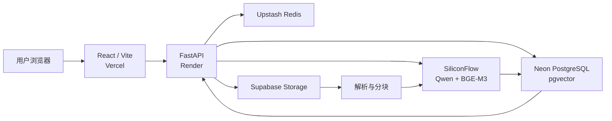

# AI Deep Research Agent

面向研究资料的云端 RAG 与深度研究系统。用户可以上传 PDF、TXT 或 Markdown 文档，系统自动完成解析、分块、向量化和索引，并基于检索证据生成带原文引用的回答。

## 在线体验

- 前端：https://ai-deep-research-agent.vercel.app
- 后端 API：https://ai-deep-research-agent-api.onrender.com
- API 文档：https://ai-deep-research-agent-api.onrender.com/docs

> Render 免费实例长时间无访问后会休眠，首次请求可能需要约 50 秒启动。

## 核心能力

- 文档上传、去重、持久化管理与状态追踪
- PDF、TXT、Markdown 文本解析与 Token 分块
- BGE-M3 文本向量化与 PostgreSQL/pgvector HNSW 检索
- 基于检索证据的 RAG 回答生成与原文引用
- LangGraph 多步骤深度研究工作流
- 云端 PostgreSQL、Redis、S3 兼容对象存储与模型服务
- 健康检查、数据库迁移、自动化测试和持续部署

## 系统架构



## 技术栈

| 层级 | 技术 |
| --- | --- |
| 前端 | React、TypeScript、Vite、Lucide React |
| 后端 | FastAPI、Pydantic、SQLAlchemy Async |
| AI | Qwen2.5-7B-Instruct、BGE-M3、LangGraph |
| 数据 | PostgreSQL、pgvector、HNSW、Redis |
| 存储 | S3 兼容对象存储 |
| 工程 | Alembic、pytest、Ruff、Docker Compose |
| 部署 | Vercel、Render、Neon、Upstash、Supabase |


## 本地运行

### 1. 启动基础设施

```powershell
docker compose up -d
```

### 2. 配置后端

```powershell
Copy-Item backend\.env.example backend\.env
```

编辑 `backend/.env`，填写数据库、Redis、对象存储和模型服务配置。不要将真实密钥提交到 Git。

### 3. 初始化数据库

```powershell
uv sync --directory backend
uv run --directory backend alembic upgrade head
```

### 4. 启动后端

```powershell
uv run --directory backend uvicorn app.main:app --reload
```

后端默认运行于 `http://127.0.0.1:8000`，Swagger 文档位于 `http://127.0.0.1:8000/docs`。

### 5. 启动前端

```powershell
npm install --prefix frontend
npm run dev --prefix frontend
```

前端默认运行于 `http://localhost:5173`。


## 主要 API

| 方法 | 路径 | 用途 |
| --- | --- | --- |
| GET | `/health` | 服务存活检查 |
| GET | `/health/ready` | 数据库与 Redis 就绪检查 |
| GET | `/api/v1/documents` | 获取文档列表 |
| POST | `/api/v1/documents` | 上传研究资料 |
| POST | `/api/v1/documents/{id}/process` | 解析、分块并建立向量索引 |
| DELETE | `/api/v1/documents/{id}` | 删除文档及相关数据 |
| POST | `/api/v1/search` | 向量语义检索 |
| POST | `/api/v1/rag/answer` | 生成带引用的 RAG 回答 |
| POST | `/api/v1/research` | 执行多步骤深度研究工作流 |

## 质量验证

```powershell
uv run --directory backend ruff check .
uv run --directory backend pytest
npm run build --prefix frontend